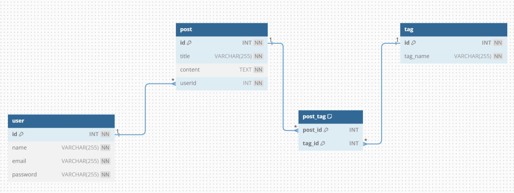

# Blog App

##  Quick Links

> - [ Overview](#-overview)
> - [ Features](#-features)
> - [ Repository Structure](#-repository-structure)
> - [ Getting Started](#-getting-started)
>   - [ Project Setup](#-project-setup)
>   - [ Installation](#-installation)
>   - [ Running Blog-App](#-running-Blog-App)
>   - [ Testing](#-testing)

---

##  Overview

Welcome to the backend repository for the Blog Platform! This project is designed to support a community of users who can create blog posts categorized by tags. It provides various endpoints for user management, post creation and management, tag retrieval, and robust error handling. `overview`

---

##  Features

User Management: Register new users and authenticate existing users.

Post Management: Create, retrieve, update, and delete blog posts.

Tagging System: Associate multiple tags with each post to categorize content.

Error Handling: Implement robust error handling with appropriate HTTP status codes and error messages.

Database Integration: Utilize MySQL database for storing users, posts, tags, and their relationships.

Scalability: Designed to handle multiple users creating and managing posts concurrently.

Security: Implement basic authentication for user login and access control. `features`

---

##  Repository Structure


```sh
└── Blog-App/
    ├── app.js
    ├── controllers
    │   ├── postController.js
    │   ├── tagController.js
    │   └── userController.js
    ├── middleware
    │   └── authMiddleware.js
    ├── package-lock.json
    ├── package.json
    ├── routes
    │   ├── postRouter.js
    │   ├── tagRouter.js
    │   └── userRouter.js
    ├── sql
    │   └── dbQueries.db
    ├── test
    │   └── BLOG APP.postman_collection.json
    └── util
        ├── database.js
        ├── handleValidationError.js
        └── validators.js
```
---

##  Getting Started

### Project Setup

1. DB Setup:

```sh
execute all the queries present in Blog-App/sql/dbQueries.db in top to bottom order
```

2. Postman Setup:

```sh
import Blog-App/test/BLOG APP.postman_collection.json file in your postman
```
###  Installation

1. Clone the Blog-App repository:

```sh
git clone https://github.com/karodehemant9/Blog-App
```

2. Change to the project directory:

```sh
cd Blog-App
```

3. Install the dependencies:

```sh
npm install
```

###  Running Blog-App

Use the following command to run Blog-App:

```sh
node app.js OR npm start
```


###  Testing

1. Run the Postman Collection:

```sh
Using the run collection option. It will automatically run tests for all the APIs
```
2. Run the Postman API manually to check each endpoint


## Misc

### Schema Design


### Postman


